# QuantPricer — Multi-Model Derivatives Pricing Engine

A comprehensive C++17 quantitative finance library covering derivatives pricing, risk management, fixed income, and market microstructure. Built over 15 days as a systematic learning project.

**17 header modules | 142 tests | 11 showcase plots | 15 example programs**

```
make release     # build everything
make run-tests   # 142 tests, 0 failures
make showcase    # generate all plots below
```

---

## Results at a Glance

| Method | Price | Error vs BS |
|--------|-------|-------------|
| **Black-Scholes (analytic)** | 10.4506 | — |
| **Monte Carlo (500k paths)** | 10.4413 | 0.009 |
| **FDM Crank-Nicolson (400x2000)** | 10.4515 | 0.001 |
| **Binomial Tree (N=1000)** | 10.4486 | 0.002 |
| **Heston MC (100k paths)** | 10.423 | stoch vol |
| **American Put (tree)** | 6.090 | EE premium = 0.52 |

*ATM European Call: S=100, K=100, r=5%, T=1y, σ=20%*

---

## Volatility Surface

Three correlation values showing how `ρ` controls the implied vol skew in the Heston model.

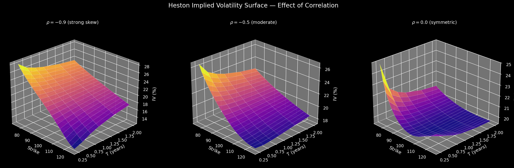

- **ρ = -0.9**: steep negative skew (crash protection expensive)
- **ρ = -0.5**: moderate skew (most realistic for equities)
- **ρ = 0.0**: symmetric smile (no leverage effect)

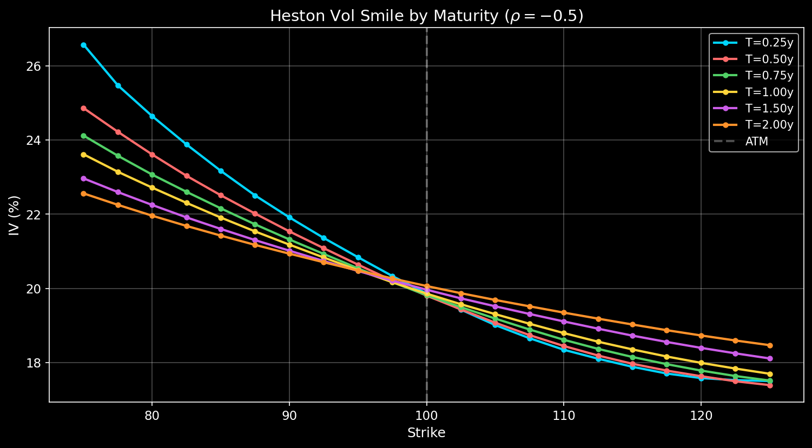

---

## Greeks Dashboard

All five first-order Greeks computed analytically from Black-Scholes.

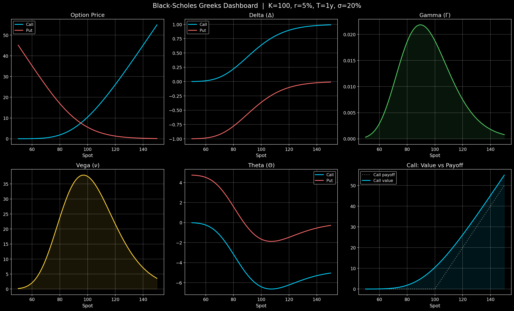

---

## Monte Carlo Convergence

Price convergence and standard error at three volatility levels (σ=15%, 25%, 40%). SE follows the theoretical O(1/√N) rate.

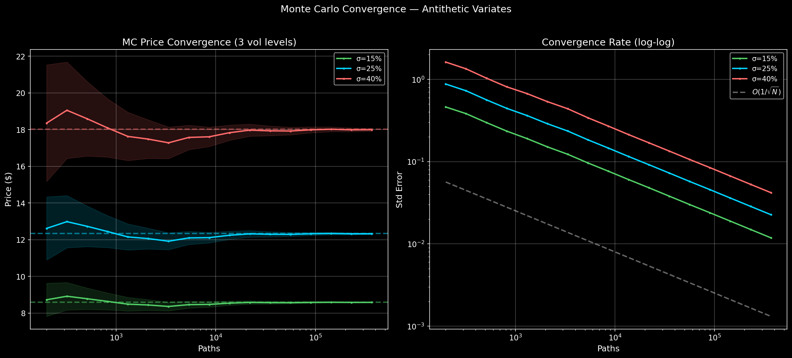

---

## Model Comparison — BS vs Heston vs Merton

Heston (stochastic vol, ρ=-0.7) produces a skew. Merton (jumps) produces fatter tails. Both depart from BS flat vol in different ways.

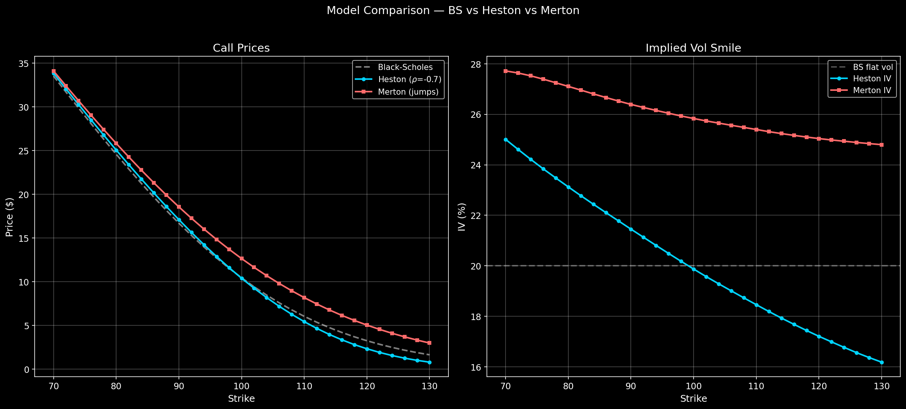

---

## Barrier Options

Down-and-out/in call prices at three volatility levels (σ=15%, 25%, 35%). Higher vol = more likely to hit the barrier = cheaper knock-out.

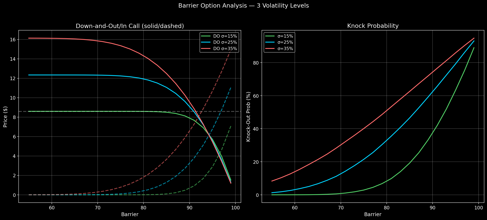

---

## Correlation Trade — Multi-Asset Options

The key structured products insight: best-of decreases with ρ, worst-of increases, basket increases. At ρ=1 all converge. Right panel shows basket vol → σ√ρ as N→∞.

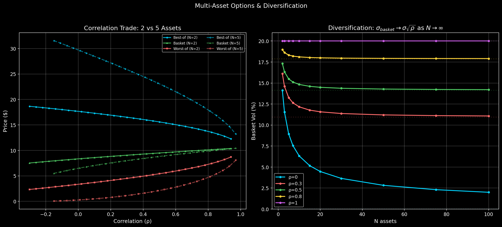

---

## American Options — Early Exercise Premium

American put vs European put at three interest rate levels (r=2%, 5%, 10%). Higher rates = larger early exercise premium.

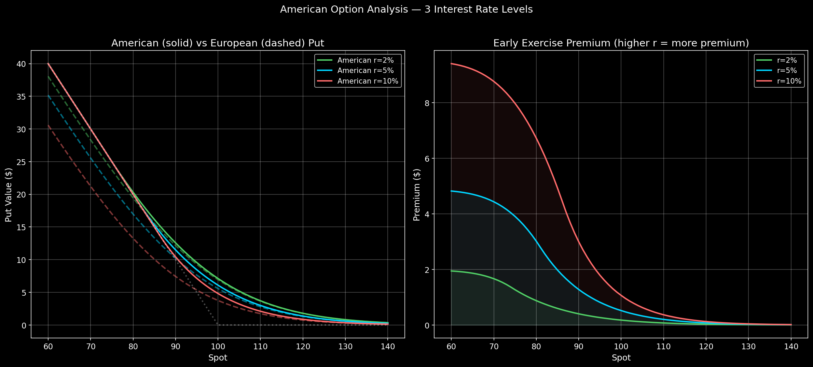

---

## Finite Difference Method

Crank-Nicolson solution (400×2000 grid) overlaid on BS analytic. Error < 0.001 for both calls and puts.

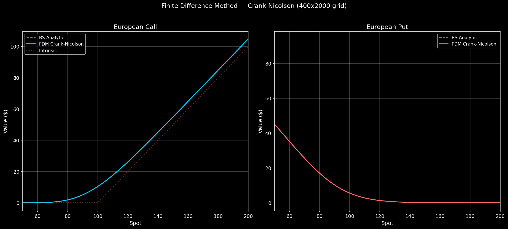

---

## Yield Curves & Rate Models

Left: three Nelson-Siegel curve shapes (normal, flat, inverted). Right: Vasicek vs CIR model-implied yield curves.

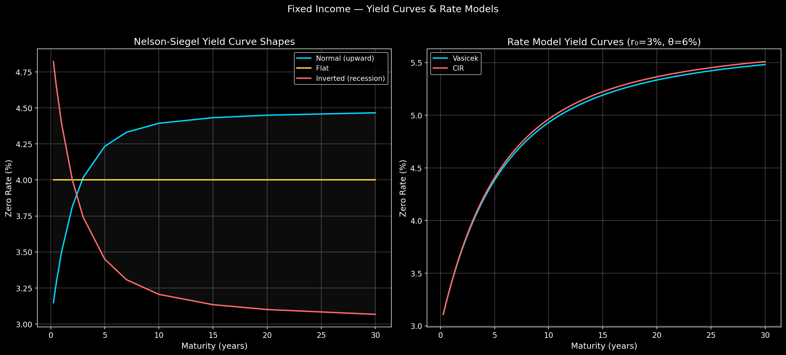

---

## Payoff Profiles

Classic call, put, and straddle payoffs at expiry (dotted) vs present value with time value (solid).

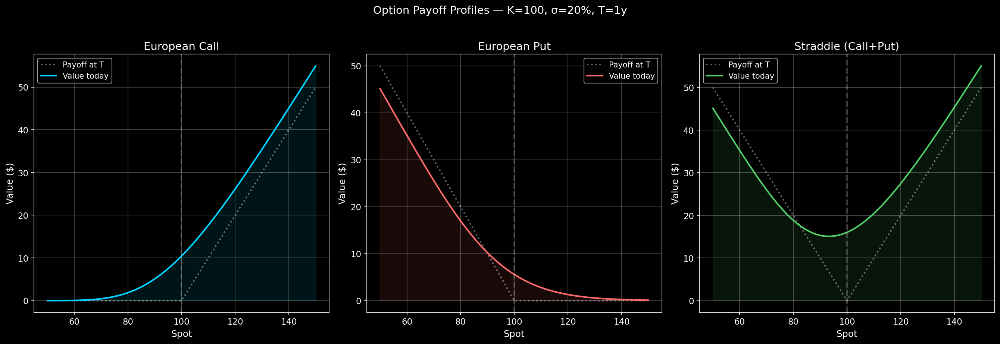

---

## Architecture

```
include/
  payoff/         PayOff hierarchy (call, put, digital, power)
  option/         VanillaOption, HestonParams, MertonJumpParams
  greeks/         BS analytics + FD + MC Greeks engine
  mc/             European, Asian, Heston, Merton MC + Longstaff-Schwartz
  fdm/            Crank-Nicolson FDM solver
  tree/           CRR binomial tree (European + American)
  vol/            Implied vol (Newton-Raphson, bisection) + vol surface
  barrier/        8 barrier types (Haug analytic) + MC + BGK correction
  multi_asset/    Basket, best-of, worst-of, Margrabe + Cholesky MC
  risk/           VaR, CVaR, Sharpe/Sortino/Calmar, stress testing
  fixed_income/   Yield curves, bootstrapping, Nelson-Siegel, bonds, duration/DV01
  rates/          Vasicek, CIR, Hull-White + bond options
  orderbook/      CLOB matching engine (price-time priority)
  matrix/         QMatrix, LU, Thomas, Cholesky decomposition
  rng/            Mersenne Twister, Box-Muller, correlated normals
```

## Build

```bash
# Requirements: C++17 compiler, Python 3 with numpy, pandas, matplotlib (for plots)
make release        # optimized build (-O3)
make debug          # debug build with AddressSanitizer
make run-tests      # run 142 tests
make showcase       # generate all plots above
make dashboard      # interactive Streamlit dashboard (localhost:8501)
make viz            # legacy static plot generation
```

## Daily Progression

| Day | Topic | Key Concepts |
|-----|-------|-------------|
| 1 | OOP & PayOff Hierarchy | Inheritance, virtual functions, clone pattern |
| 2 | Matrix & Linear Algebra | Templates, LU, Thomas algorithm, Cholesky |
| 3 | Implied Volatility | Newton-Raphson, bisection root-finding |
| 4 | Random Number Generation | Mersenne Twister, Box-Muller, statistical distributions |
| 5 | Black-Scholes & European MC | Analytic pricing, antithetic variates |
| 6 | Greeks Engine | Analytic, finite difference, MC pathwise Greeks |
| 7 | Asian & Path-Dependent | Arithmetic/geometric averaging, path generation |
| 8 | Jump-Diffusion | Merton model, Poisson jumps, compensator |
| 9 | Heston Stochastic Vol | Euler discretization, full truncation, Cholesky correlation |
| 10 | Barrier Options | Haug analytic (8 types), BGK continuity correction |
| 11 | Multi-Asset Options | Basket, best-of, worst-of, Margrabe exchange formula |
| 12 | Risk Management | VaR, CVaR, Sharpe/Sortino/Calmar, stress testing |
| 13 | Fixed Income | Yield curves, bootstrapping, Nelson-Siegel, duration, DV01 |
| 14 | Interest Rate Models | Vasicek, CIR (Feller condition), Hull-White, bond options |
| 15 | Order Book | CLOB, price-time priority matching, limit/market orders |

## Key References

- Joshi, *C++ Design Patterns and Derivatives Pricing* (Cambridge, 2008)
- Glasserman, *Monte Carlo Methods in Financial Engineering* (Springer, 2003)
- Haug, *The Complete Guide to Option Pricing Formulas* (2007)
- Hull, *Options, Futures, and Other Derivatives* (Pearson, 2018)
- Duffy, *Finite Difference Methods in Financial Engineering* (Wiley, 2006)
- Lord, Koekkoek & Van Dijk, *A Comparison of Biased Simulation Schemes for SV Models* (2010)
- Broadie, Glasserman & Kou, *Continuity Correction for Discrete Barrier Options* (1997)
- Margrabe, *The Value of an Option to Exchange One Asset for Another* (1978)
- Artzner et al., *Coherent Measures of Risk* (1999)
